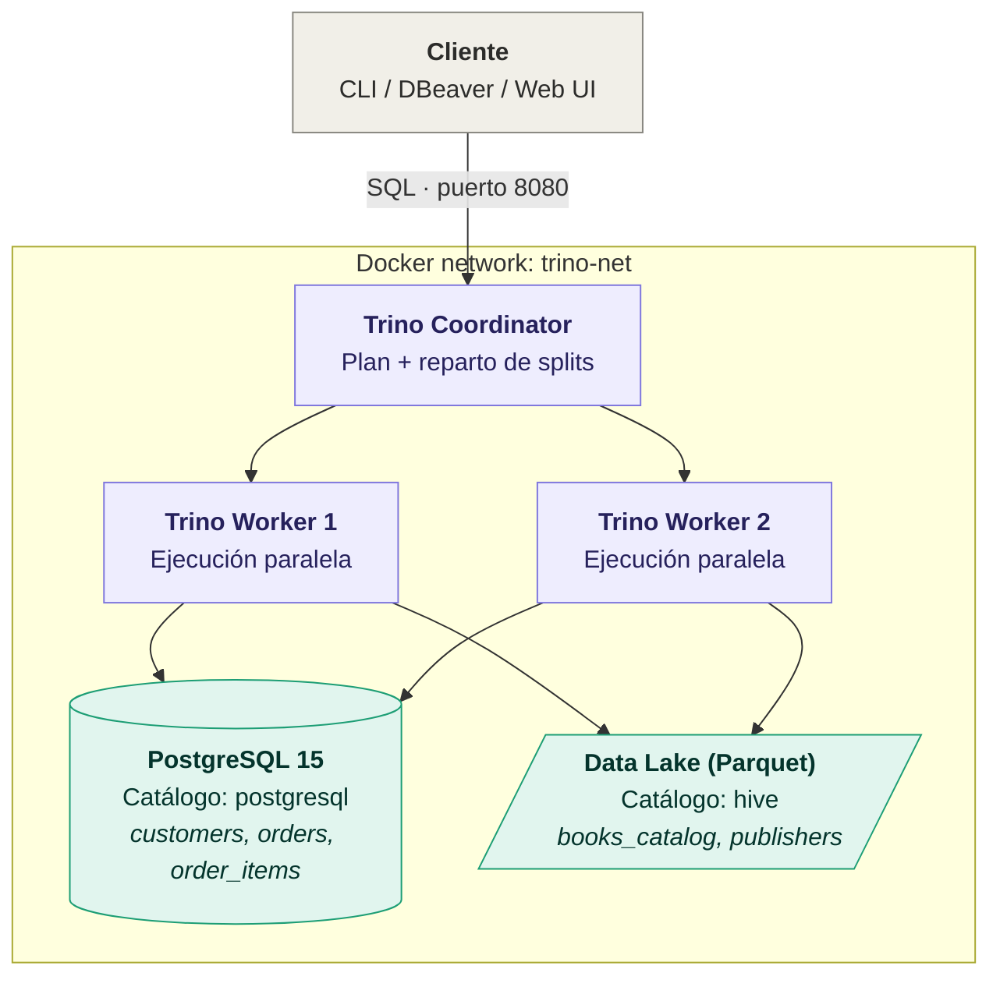

```mermaid
flowchart TD
    Client["<b>Cliente</b><br/>CLI / DBeaver / Web UI"]

    subgraph TrinoNet["Docker network: trino-net"]
        Coord["<b>Trino Coordinator</b><br/>Plan + reparto de splits"]
        Worker1["<b>Trino Worker 1</b><br/>Ejecución paralela"]
        Worker2["<b>Trino Worker 2</b><br/>Ejecución paralela"]
        Postgres[("<b>PostgreSQL 15</b><br/>Catálogo: postgresql<br/><i>customers, orders, order_items</i>")]
        Datalake[/"<b>Data Lake (Parquet)</b><br/>Catálogo: hive<br/><i>books_catalog, publishers</i>"/]
    end

    Client -->|"SQL · puerto 8080"| Coord
    Coord --> Worker1
    Coord --> Worker2
    Worker1 --> Postgres
    Worker1 --> Datalake
    Worker2 --> Postgres
    Worker2 --> Datalake

    classDef trino fill:#EEEDFE,stroke:#7F77DD,color:#26215C,stroke-width:1px
    classDef data fill:#E1F5EE,stroke:#1D9E75,color:#04342C,stroke-width:1px
    classDef client fill:#F1EFE8,stroke:#888780,color:#2C2C2A,stroke-width:1px

    class Coord,Worker1,Worker2 trino
    class Postgres,Datalake data
    class Client client
```